# What is Stable Diffusion?

**First** these image generating processes are not a perfect process. Jeremy tried to tune a model for a teddy bear "tiny" riding a horse, and was unsuccessful. Similarly even teddy bears on pink rug, also did not produce the expected images.

## Concept: Stable Diffusion to generate handwritten digits

For a conceptual example, let's consider the following:

- Make a hand-written digit image generator
- imagine some function `f(x)` that if you fed it an image it could give you a probability `P(x) = 0.97` meaning a image was a hand-written digit
- if the image is very noisy, then the `P(x) = 0.02` would be very low
- **Premise**: if a function like this exists, this `f(x)` could be used to generate images

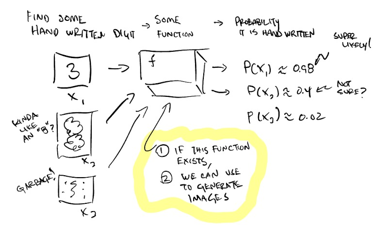


#### What happens if the image is "tweaked"?

- Now consider the low scoring image `X3`. If a few pixels are turned darker, or lighter - maybe to form a `7` or leg of `4`,
- This will in turn also increase the `P(X)` that the image is of a hand-written image
- considering pixel by pixel tweaks and changes, this is close to calculating the gradient of the probability over the pixels

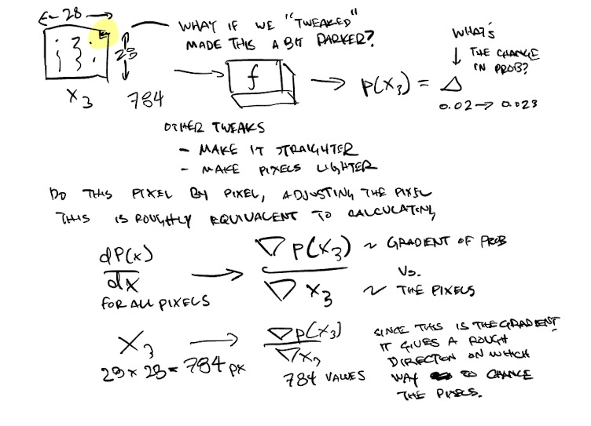

#### If we had the gradient, what would we do with it?

- if we could get the gradient, we could **subtract** it from the original image, meaning the image would slowly become more like a "real" hand-written number
- in `deep-learning` the gradient is changing the weights of the model. In `stable diffusion` we are changing the pixels of the image

1. Start with an image
2. subtract the gradient (will talk about how we get this later) times some `C` constant
3. image will be updated (ideally closer to a real number)
4. the probability is re-evaluated, would probably go up by a small bit

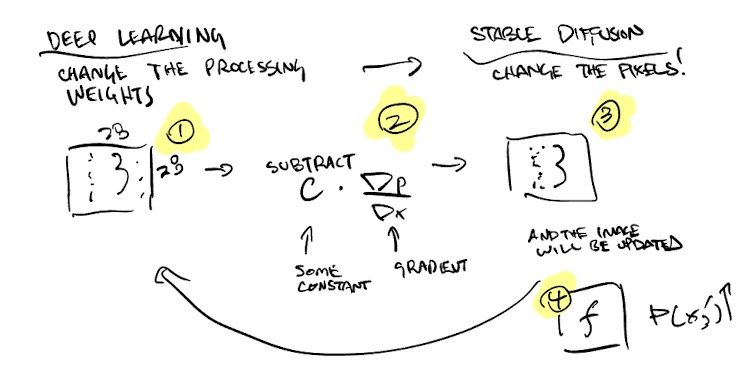


#### How to calculate the gradient?

- just like in high-school calculus, each pixel's gradient could be calculated
- for MNIST images, this is `28 x 28 == 784px`, which is a lot of calculations to do, **very slow**
- it would be much better if there existed a `f.backward()` function that would provide us the `grad_X3`
- But first, what is our `f` going to be? Hint: a `neural-network`

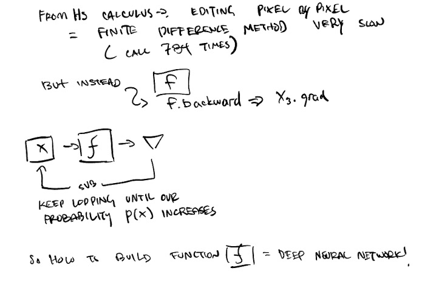

#### High-level problem definition

- lets assume our `NN` problem definition will be the following: `predict how much noise is in an image`
- **Why?** because quantifying "similarity to a hand-written number" is very difficult
- Need to define
    - inputs
    - outputs
    - loss function
    
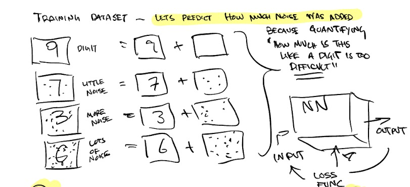

#### A forward-cycle

- inputs: `IMG + N(sigma, mu)`, in this case messy images
- outputs: `N_hat(sigma, mu)` predicted noise, in this case an image of ONLY noise
- loss function: `MSE`
- calculate the gradient from the `MSELoss.backward()`
- subtract gradient from `IMG - grad` and repeat!

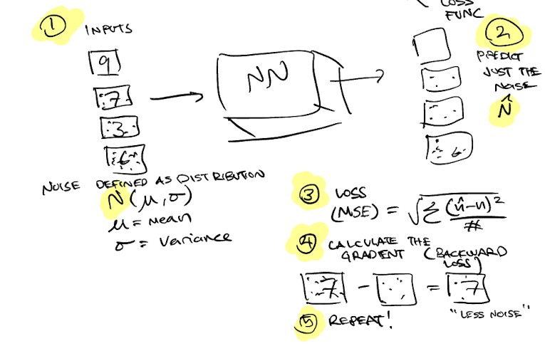

Sample cycle, a noisy image coes in, the `NN` predicts what it thinks is noise, we subtract it, and the image gets closer to looking like a `4`

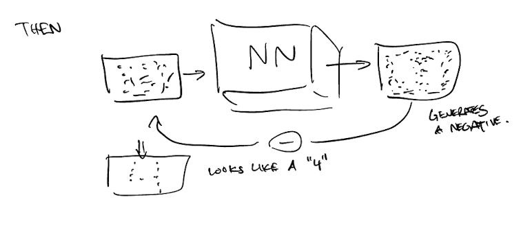

### So... how to add noise?

`MNIST` images are very tiny + only black in white. Normal images are `512 x 512 x 3 = 6MB!` (last one is color channels RGB). This data "volume" will be difficult to process, how can it be done more efficiently?

- If the internet is considered, there are many full-sized images floating around that don't take the full space
- HD image `(1920 x 1080 x 3) = 6MB`!, and there are plenty of images much smaller `100KB`
- Hint: think about JPEGs ... image compression!

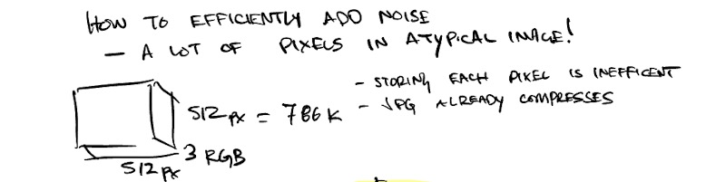

#### Introducing autoencoders

The original volume is on the left, `512 x 512 x 3`, if we do the following:

```
[INPUT] IMG_RAW (512 x 512 x 3) -> ~6,000,000
  <conv, stride 2> -> (256 x 256 x 6)
  <conv, stride 2> -> (128 x 128 x 12)
  <conv, stride 2> -> (64 x 24 x 24)
  <resnet blocks> ->
    (64 x 4 x 4) -> 16,000 (much smaller)
  <resnet blocks> -> (64 x 24 x 24)
  <conv, stride 2> -> (128 x 128 x 12)
  <conv, stride 2> -> (256 x 256 x 6)
  <conv, stride 2> -> 
    [OUTPUT] IMG_RAW (512 x 512 x 3)
```

Its a very strange `NN` design, that keeps shrinking the dimensions to a point via convolutions, then does the reverse, expanding with other convolutions till the output is ... the same image.

- Inputs: Image sized `512 x 512 x 3`
- Outputs: Image sized `512 x 512 x 3`
- What's the point of this?

The main point of architectures like this is to "compress" complex inputs into smaller vector spaces. 

- it can be for data storage size reasons
- it can be for extremely sparse inputs
- it could be for very correlated inputs, aka a non-linear PCA approach

Anything that Shrinks the inputs, or the first half is called the `encoder`. Anything that expands the size is the `decoder`. So imagine, if our entire audience had the same trained + fit `decoder`, then "compressed" data files could be passed around instead of the full-sized one. We already do this today with JPEGS.

Since the loss function is basically "is this the same image", `MSE` will be used again to calculate the pixel vs pixel difference. This is trained over a large corpus of images

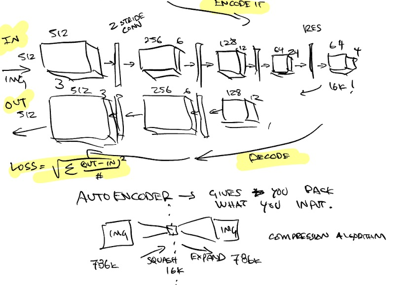

#### Assembling the compressor + expander with the NN

- first the auto-encoder will be trained independently
- once its fit, it is dis-assembled into `encoder` and `decoder` parts
- `Raw Images` are compressed in the `encoder` into `latents`
- `Latents` are fed into the `NN aka Unet` which will predict `noise-only-latents`
- `noise-only-latents` will be expanded into the full `image` size

Caveat: this `auto-encoder` approach is optional if you have infinite compute, but it is very resource hungry

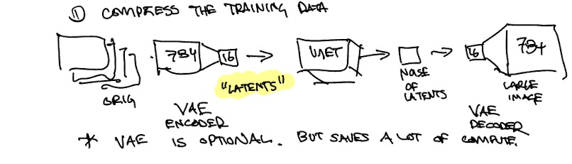

## What about captions?

We've talked about how images are created, but what about the prompt `astronaut riding a horse` how does the `text` fit into the image creation?

In the handwritten numbers case, there's only 10 possible digits, so a `1-hot vector (size 10)` could be passed to the `NN` to give the model more information about what noise to target.

The main issue with this is there are too many phrases in the english language to make a 1-hot vector large enough. So another approach is needed to do the following:

- `astronaut on a horse` -> a vector
- `football in the style of monet` -> different vector

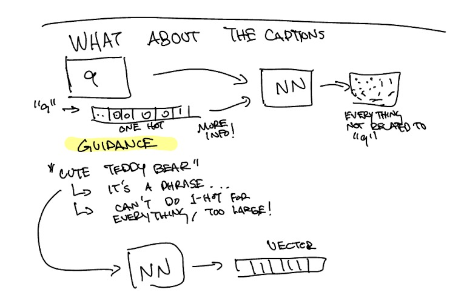

### Captions to vectors: an example

Let's say there are 3 images:
- dinosaur
- bird
- flaming sword

From the internet, many of these images have short text phrases describing them for accessibility purposes (people who have a hard time seeing, there's text descriptions). A sample HTML code would look like the following:

```html


```

Now that images + phrases have be associated, we can make a `siamese-net` like approach. 

- the `text` will have its own encoder, say (1 x 64)
- the `image` will have its own encoder say (1 x 64)
- the `text_vectors` and the `image_vectors` will be dot-product with each other to give a `closeness` score. `0.95` means they are related `0.01` would mean the image + the caption are not related
- the loss function will consider both correct answers and incorrect answers
    - dino + "a hungry dinosaur" should be a high score
    - sword + "a soaring bird" should be a low score

- and through this both the `text_encoder` and the `image_encoder` will be trained

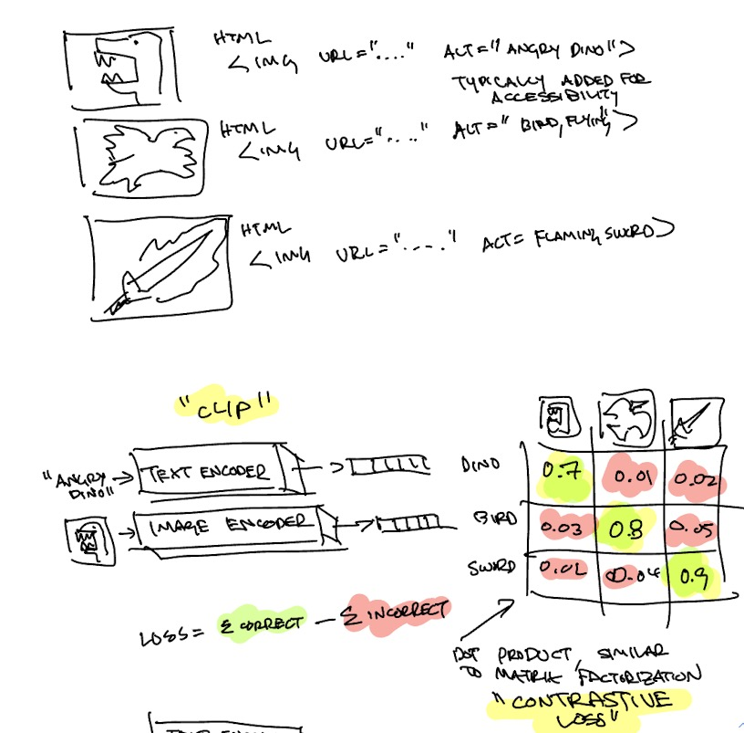

How to pick your randomness

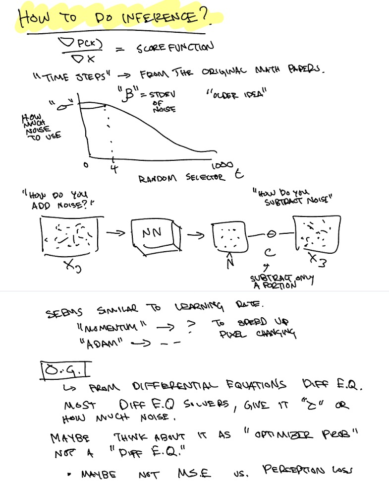

